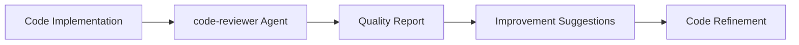
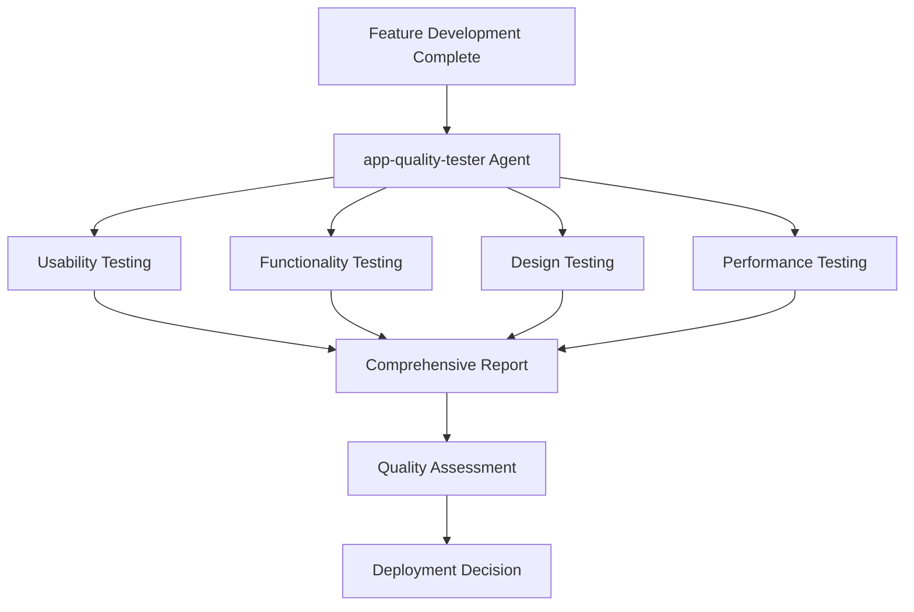
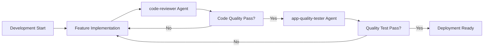

# Claude Agents Configuration Guide
# Claude Agents 設定ガイド

This document provides detailed information about specialized Claude Agents configured for enhanced development workflows.
このドキュメントでは、開発ワークフロー強化のために設定された専門化Claude Agentsについて詳細に説明します。

## 📋 Table of Contents / 目次

### 🤖 [Core Development Agents](#-core-development-agents--コア開発agents)
- [code-reviewer Agent](#code-reviewer-agent) - Code Quality Review & Improvement
- [app-quality-tester Agent](#app-quality-tester-agent) - Comprehensive Application Testing

### 🧠 [SuperClaude Framework Integration](#-superclaudeフレームワーク統合)
- [Business Expert Panel](#business-expert-panel--ビジネス専門家パネル)
- [Specialized Agent Types](#specialized-agent-types--専門エージェント種別)

### ⚙️ [Agent Configuration](#-agent-configuration--agent設定)
- [Configuration Files](#configuration-files--設定ファイル)
- [Agent Activation](#agent-activation--エージェント起動)
- [Workflow Integration](#workflow-integration--ワークフロー統合)

### 🔧 [Usage Patterns](#-usage-patterns--使用パターン)
- [Automatic Triggering](#automatic-triggering--自動起動)
- [Manual Invocation](#manual-invocation--手動起動)
- [Parallel Execution](#parallel-execution--並列実行)

### 📊 [Performance Metrics](#-performance-metrics--パフォーマンス指標)
- [Quality Standards](#quality-standards--品質基準)
- [Success Criteria](#success-criteria--成功基準)
- [Monitoring Dashboard](#monitoring-dashboard--監視ダッシュボード)

## 🤖 Core Development Agents / コア開発Agents

### code-reviewer Agent
**Function / 機能**: Code quality review and improvement suggestions / コード品質レビューと改善提案

```markdown
name: code-reviewer
model: sonnet
color: cyan
```

**Specialized Areas / 専門領域**:
- Code accuracy and bug checking / コードの正確性とバグチェック
- Performance and security analysis / パフォーマンス・セキュリティ分析
- Readability and maintainability evaluation / 可読性・保守性の評価
- Language-specific idioms and convention compliance / 言語固有のイディオム・規約遵守
- Design patterns and architecture evaluation / 設計パターンとアーキテクチャ評価

**Usage Timing / 使用タイミング**:
- Automatic review after new feature implementation / 新機能実装後の自動レビュー
- Quality check after refactoring / リファクタリング後の品質確認
- Pre-pull request checks / プルリクエスト前の事前チェック
- Coding standard compliance verification / コーディング標準の遵守確認

**Workflow Integration / ワークフロー統合**:


**Example Usage / 使用例**:
```
1. 新機能実装完了
2. code-reviewer エージェント起動
3. コード品質分析実行
4. 改善提案レポート生成
5. 修正・最適化実施
```

### app-quality-tester Agent
**Function / 機能**: Comprehensive application quality testing / アプリケーション品質総合テスト

```markdown
name: app-quality-tester
model: sonnet
color: blue
```

**Testing Areas / テスト領域**:

1. **Usability / ユーザビリティ**:
   - Navigation flow testing / ナビゲーション・フロー・テスト
   - Form operation testing / フォーム操作・テスト
   - Accessibility compliance / アクセシビリティ・テスト

2. **Functionality / 機能性**:
   - Normal and edge case scenario testing / 正常・異常系のシナリオテスト
   - API integration testing / API統合テスト
   - Data validation testing / データバリデーションテスト

3. **Design / デザイン**:
   - UI consistency checking / UI一貫性チェック
   - Color contrast analysis / 色彩コントラスト分析
   - Responsive design testing / レスポンシブ対応テスト

4. **Performance / パフォーマンス**:
   - Loading time measurement / 読み込み時間測定
   - Operation delay analysis / 操作遅延分析
   - Network condition testing / ネットワーク条件テスト

**Usage Timing / 使用タイミング**:
- Comprehensive testing after new feature completion / 新機能完成後の包括的テスト
- Quality verification before deployment / デプロイ前の品質確認
- Impact assessment after UI/UX changes / UI/UX変更後の影響確認
- User acceptance test preparation / ユーザー受け入れテスト準備

**Testing Workflow / テストワークフロー**:


**Example Testing Scenarios / テストシナリオ例**:

**Usability Testing / ユーザビリティテスト**:
```
- ユーザー登録フローの完了可能性
- メインナビゲーションの直感性
- エラーメッセージの理解しやすさ
- キーボードナビゲーション対応
```

**Functionality Testing / 機能テスト**:
```
- APIエンドポイントのレスポンス検証
- データベース操作の整合性
- エラーハンドリングの適切性
- セキュリティ制御の動作確認
```

**Design Testing / デザインテスト**:
```
- ブランドガイドライン準拠
- レスポンシブデザイン動作
- アクセシビリティ基準適合
- 視覚的一貫性維持
```

**Performance Testing / パフォーマンステスト**:
```
- ページ読み込み速度 (<3秒)
- API応答時間 (<500ms)
- リソース使用量最適化
- モバイル環境対応
```

## 🔄 Agent Integration Workflows / エージェント統合ワークフロー

### Multi-Agent Development Cycle / マルチエージェント開発サイクル



### Recommended Agent Usage Patterns / 推奨エージェント使用パターン

**Pattern 1: Sequential Quality Assurance / 順次品質保証**
```
1. Feature Development → code-reviewer → Fixes → app-quality-tester → Deployment
```

**Pattern 2: Parallel Analysis / 並行分析**
```
1. Feature Complete
2. code-reviewer (Code Analysis) || app-quality-tester (App Testing)
3. Consolidated Quality Report
4. Deployment Decision
```

**Pattern 3: Continuous Integration / 継続的統合**
```
1. Every Commit → code-reviewer (Automated)
2. Every PR → app-quality-tester (Automated)
3. Release Branch → Both Agents (Comprehensive)
```

## 🛠️ Agent Configuration / エージェント設定

### Configuration Location / 設定場所
```
.claude/agents/
├── code-reviewer.md
└── app-quality-tester.md
```

### Agent Definition Format / エージェント定義フォーマット
```markdown
name: agent-name
model: sonnet|haiku|opus
color: blue|cyan|green|yellow|red
description: Agent purpose and capabilities
```

### Environment Integration / 環境統合

**VS Code Integration / VS Code統合**:
- Automatic agent triggering on file save / ファイル保存時の自動エージェント起動
- Inline quality suggestions / インライン品質提案
- Error highlighting and fixes / エラーハイライト・修正提案

**Git Hooks Integration / Git フック統合**:
```bash
# Pre-commit hook
.git/hooks/pre-commit
├── code-reviewer validation
└── Basic quality checks

# Pre-push hook
.git/hooks/pre-push
├── app-quality-tester execution
└── Comprehensive testing
```

## 📊 Quality Metrics and Reporting / 品質メトリクス・レポート

### Code Quality Metrics / コード品質メトリクス
- **Complexity Score / 複雑度スコア**: Cyclomatic complexity analysis
- **Maintainability Index / 保守性指標**: Code maintainability assessment
- **Security Score / セキュリティスコア**: Vulnerability detection
- **Performance Score / パフォーマンススコア**: Efficiency analysis

### Application Quality Metrics / アプリケーション品質メトリクス
- **Usability Score / ユーザビリティスコア**: User experience assessment
- **Accessibility Score / アクセシビリティスコア**: WCAG compliance
- **Performance Score / パフォーマンススコア**: Speed and efficiency
- **Compatibility Score / 互換性スコア**: Cross-platform support

### Reporting Format / レポート形式
```json
{
  "agent": "code-reviewer",
  "timestamp": "2025-01-13T10:30:00Z",
  "quality_score": 85,
  "issues_found": 3,
  "suggestions": [
    {
      "type": "performance",
      "severity": "medium",
      "file": "src/components/UserList.tsx",
      "line": 45,
      "description": "Consider implementing React.memo for performance optimization",
      "suggestion": "Wrap component with React.memo to prevent unnecessary re-renders"
    }
  ],
  "overall_assessment": "Good code quality with minor optimization opportunities"
}
```

## 🚀 Best Practices / ベストプラクティス

### Agent Usage Guidelines / エージェント使用ガイドライン

1. **Regular Code Reviews / 定期的なコードレビュー**:
   - Run code-reviewer after every significant change
   - Address suggestions before moving to testing phase

2. **Comprehensive Testing / 包括的テスト**:
   - Use app-quality-tester before every release
   - Test on multiple devices and browsers

3. **Continuous Improvement / 継続的改善**:
   - Track quality metrics over time
   - Adjust development practices based on agent feedback

### Performance Optimization / パフォーマンス最適化

**Code-reviewer Optimization / code-reviewer最適化**:
- Focus on critical code paths
- Prioritize security and performance issues
- Batch review multiple files for efficiency

**App-quality-tester Optimization / app-quality-tester最適化**:
- Test core user journeys first
- Use parallel testing for different aspects
- Cache test results for similar scenarios

## 🔗 Integration with MCP Servers / MCPサーバーとの統合

### Recommended Agent + MCP Combinations / 推奨エージェント + MCP組み合わせ

**Code Quality Workflow / コード品質ワークフロー**:
```
code-reviewer + Serena MCP + GitHub MCP
↓
Semantic Analysis → Code Review → Repository Management
```

**Application Testing Workflow / アプリケーションテストワークフロー**:
```
app-quality-tester + Playwright MCP + Notion MCP
↓
Automated Testing → Test Execution → Documentation
```

**Development Lifecycle / 開発ライフサイクル**:
```
Gemini MCP → code-reviewer → app-quality-tester → GitHub MCP
↓
AI Assistance → Code Quality → App Testing → Version Control
```

## 🔗 Related Documentation / 関連ドキュメント

- **[MCP_SERVERS.md](./MCP_SERVERS.md)** - MCP server configurations / MCPサーバー設定
- **[SETUP_GUIDE.md](./SETUP_GUIDE.md)** - Setup and troubleshooting / セットアップとトラブルシューティング
- **[PROJECT_STRUCTURE.md](./PROJECT_STRUCTURE.md)** - Project architecture / プロジェクトアーキテクチャ
- **[CLAUDE.md](./CLAUDE.md)** - Claude Code instructions / Claude Code指示書
- **[GEMINI.md](./GEMINI.md)** - Google Gemini instructions / Google Gemini向け指示書
- **[README.md](./README.md)** - Project overview / プロジェクト概要

---

*This document is regularly updated. Please update this document when new agents are added or configurations change.*
*このドキュメントは定期的に更新されます。新しいエージェントが追加された際や設定が変更された場合は、この文書も更新してください。*